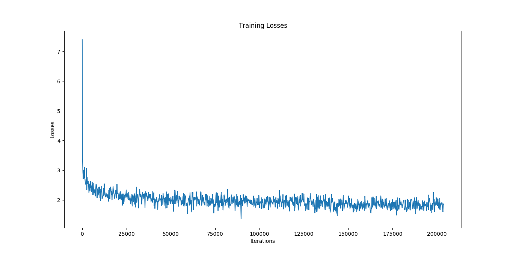
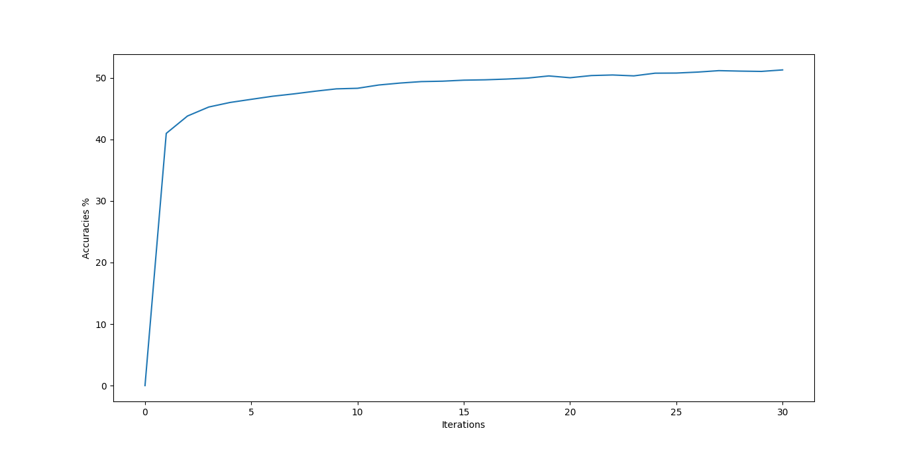

## Visual Question Answering

This project is a implementation of the paper: [Show, Ask, Attend, and Answer: A Strong Baseline For Visual Question Answering](https://arxiv.org/pdf/1704.03162.pdf). 

Deep neural networks have exploded into the industry, transforming the computer vision and natural language processing fields. Networks are able to confidently distinguish between cancer cells and translate English to French. Visual Question Answering (VQA) is an interesting intersection between these two fields. Given a image and a question about the image, and the network learns to interpret the question and image to return an answer for that question. This has many immediate applications, such as helping the blind ask questions about the world or recognising a animal in the wildlife.

### Dataset

This implementation uses the Balanced Real Images from the visualQA dataset which contains ~120k images and ~650k questions.

### Model
The model can be split into 4 main parts. Image Features, Question Features, Attention Map and Classifier.

**Image Features**

The goal of this part is to get a representation of the features present in the image. To do this, a 152 layer resnet that is pre-trained on ImageNet is used. The image is passed through this network, but the the output is taken from before the final average pooling and fully connected layers. To speed up computation during training, the image features are precomputed on the dataset.

**Question Features**

The goal of this part is get a representation of the features present in the question. A single layer LSTM is used for this purpose, with a 300 dimension word vector. 

**Attention Map**

The goal of the attention map is return areas of the image which are of interest and would be helpful in determining the answer based on the question and the image. Since this part is slightly complicated, steps will be shown in detail, together with the sizes of the matrices.

We start with the outputs from the image features and question features (denoted here as image and question respectively) 
> image: batch x 2048 x 14 x 14
> 
> question: batch x 1024

Apply 2048 -> 512 layer convolution to image

> image: batch x 512 x 14 x 14

Apply 1024 -> 512 linear layer to question

> question: batch x 512

Repeat the question along the 3rd and 4th dimensions to get the same size as the image

> question: batch x 512 x 14 x 14

Add the question and image matrices.

> combined: batch x 512 x 14 x 14

Apply the attention convolution layer 512 -> 2. 2 is the number of glimpses in the attention (how many times it looks at the image) 

> attention: batch x 2 x 14 x 14

Reshape the attention matrix so that softmax can be applied to it, and apply softmax.

> attention: batch*2 x 196

Take the original image features and reshape it to: (batch x 2048 x 2 x 196) by first flattening and then expanding. Reshape the attention matrix to the same shape.

> image: batch x 2 x 2048 x 196
> 
> attention: batch x 2 x 2048 x 196

Multiply the two vectors together and taken a weighted average along the 4th dimension.

> output: batch x 2 x 2048

Flatten the output

> output: batch x 2*2048

**Classifier**

The output from attention map and question features are concatenated and passed through a fully connected network with 1024 hidden units. It has 3000 output units, corresponding to the 3000 most frequent answers in the dataset. Therefore, after this a softmax determines the most likely answer based on the entire model.

### Results
The loss from the training

The model converges to about ~51% accuracy on the validation dataset.

**Interesting Results**

### Code

The above code can be found in the [github repo](https://github.com/bowsplinter/ask-me-anything) together with installation instructions.